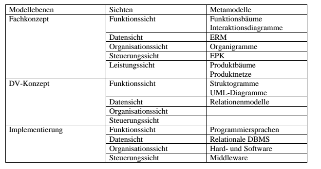
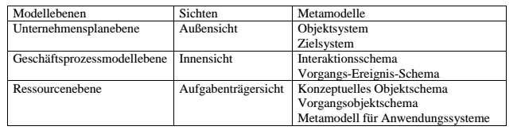
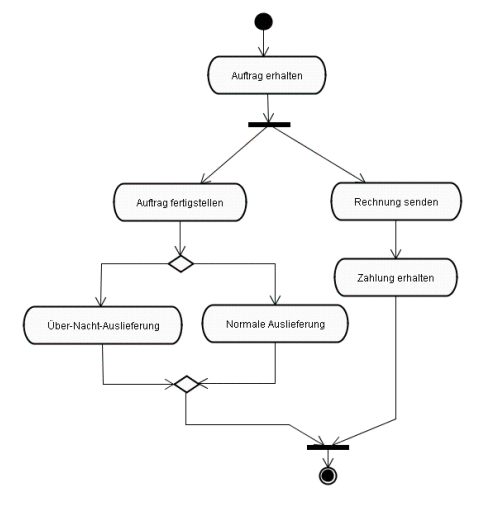

#Informationssysteme

##Dispositions- und Planungssystem 
>Definieren Sie die Begriffe Dispositions- und Planungssystem. Erläutern Sie den Unterschied dieser beiden Systeme anhand eines selbst gewählten Beispiels.

* Dispositionssysteme dienen der Entscheidungsunterstützung, indem sie entweder menschliche Entscheidungen vorbereiten oder diese entbehrlich machen. Im letzteren Fall werden Entscheidungen in automatisierter Form durch Computer getroffen. Dispositionssysteme dienen überwiegend der Lösung von wohlstrukturierten Problemen.

* Systeme, die der Vorbereitung und Unterstützung von Entscheidungen des Managements dienen, heißen Planungssysteme. Im Gegensatz zu Dispositionssystemen betreffen die Entscheidungen von Planungssystemen neben der unmittelbaren Leistungserstellung auch die Rahmenbedingungen für diese. Planungssysteme dienen im Gegensatz zu Dispositionssystemen nicht der Automatisierung von Entscheidungen.

Ein Beispiel für ein Dispositionssystem ist ein System für die Maschinenbelegungsplanung, bei dem sowohl Entscheidungen vorbereitet werden können (Vorschläge werden unterbreitet), als auch automatisiert getroffen werden (Maschinenbelegungsplan wird direkt umgesetzt). 
Im Gegensatz dazu steht beispielsweise ein Kapazitätsplanungssystem. Bei diesem System erfolgt die strategische Kapazitätsplanung, um eine Produktmixentscheidung, die zu maximalem Gewinn führt, zu treffen. Eine Produktmixentscheidung wird vom Management getroffen.

## Administrations- und Kontrollsystem 
>Definieren Sie die Begriffe Administrations- und Kontrollsystem. Nennen Sie jeweils einen Bereich eines CRM-Systems mit Kontrollsystemcharakter und Administrationssystemcharakter. Begründen Sie Ihre Entscheidung.

* Administrationssysteme sind Anwendungssysteme, die auf die Rationalisierung der Massendatenverarbeitung ausgerichtet sind. 
* Kontrollsysteme dienen der Übernahme von Informationen aus den mengen- und wertorientierten Systemen mit dem Ziel, diese aufzubereiten und als Berichte zur Verfügung zu stellen. Die aufbereiteten Informationen dienen zur Beschreibung des Betriebsgeschehens.

Der operative Bereich eines CRM-Systems hat den Charakter eines Administrationssystems, da das Tagesgeschäft von Vertrieb, Service und Benutzer-Support durch die Bereitstellung von Informationen bzw. die Steuerung von Prozessen unterstützt wird. Der analytische Bereich eines CRM-Systems kann als Kontrollsystem aufgefasst werden, da mit statistischen Methoden Daten aufbereitet, aggregiert und als Berichte zur Verfügung gestellt werden.


## Informations- und Anwendungssystem 
>a) Definieren Sie die Begriffe Informations- und Anwendungssystem.
b) Erläutern Sie die Unterschiede zwischen diesen beiden Systemen anhand eines selbst gewählten Beispiels.

* Ein Informationssystem besteht aus Menschen und Maschinen, die Informationen erzeugen und/oder diese benutzen. Die Menschen und Maschinen sind durch Kommunikationsbeziehungen miteinander verbunden. Informationssysteme übertragen und verarbeiten Informationen. Die Informationen werden dabei im Informationssystem gespeichert, abgerufen und gegebenenfalls transformiert.
* Anwendungssysteme sind Rechner- und Kommunikationssysteme mit Anwendungssoftware. Sie stellen die automatisierten Bestandteile eines Informationssystems dar und sind maschinelle Aufgabenträger. Anwendungssysteme sind typischerweise ein Teil eines Informationssystems.

In einer kleinen Gärtnerei wird im Wesentlichen das Informationssystem durch den (einzigen) Gärtner gebildet. Zur Dokumentation werden ein Auftragsbuch und Lieferscheine verwendet. In einer großen Gärtnerei mit angeschlossenem Versandhandel sieht die Situation anders aus. In diesem Betrieb werden zur Erfassung, Speicherung, Übertragung und Umwandlung von Informationen Anwendungssysteme verwendet. Dadurch lassen sich im Verkauf und bei der Warenannahme viele Tätigkeiten automatisieren. Telefone, Kopier- und Faxgeräte sind weitere maschinelle Hilfsmittel für die Informationsverarbeitung.

##Informations- und Anwendungssystem 
>Definieren Sie die Begriffe Administrations- und Kontrollsystem. Erläutern Sie die Unterschiede zwischen diesen beiden Systemen anhand eines selbst gewählten Beispiels.

* Administrationssysteme sind Anwendungssysteme, die auf die Rationalisierung der Massendatenverarbeitung ausgerichtet sind. 
* Kontrollsysteme dienen der Übernahme von Informationen aus den mengen- und wertorientierten Systemen mit dem Ziel, diese aufzubereiten und als Berichte zur Verfügung zu stellen. Die aufbereiteten Informationen dienen zur Beschreibung des Betriebsgeschehens. 

In einem Unternehmen der Maschinenbaubranche fragt ein Administrationssystem ausgehend von Kundenaufträgen in regelmäßigen Abständen den Status derjenigen Lose ab, welche die Kundenaufträge untersetzen und versorgt den entsprechenden Disponenten in der Produktion mit diesen Informationen. 
Dahingegen ermittelt ein Kontrollsystem innerhalb desselben Unternehmens in periodischen Abständen die Durchlaufzeiten der einzelnen Lose und wertet diese für die unterschiedlichen Auftragstypen oder Produkte aus.


## Stamm- und Bewegungsdaten 
> Erläutern Sie die Begriffe Stamm- und Bewegungsdaten. Orden Sie die folgenden Daten diesen beiden Klassen zu und begründen Sie Ihre Entscheidung: 
* Stückliste, 
* Fertigungsauftrag, 
* Arbeitsplan, 
* Los.

* Stammdaten sind zustandsorientierte Daten, die der Identifizierung und Charakterisierung von Sachverhalten im Unternehmen dienen und unverändert über einen längeren Zeitraum zur Verfügung stehen. 
* Als Bewegungsdaten werden abwicklungsorientierte Daten bezeichnet, die immer wieder neu durch betriebliche Leistungsprozesse entstehen. Bewegungsdaten fließen ständig in die Vorgänge der Informationsverarbeitung ein und bewirken dadurch Veränderungen von Bestandsdaten. 

**Stückliste -> Stammdaten**: Die Stückliste beschreibt die Zusammensetzung eines Produkts aus seinen Bestandteilen. In diesem Sinne wird ein Sachverhalt charakterisiert, der über einen längeren Zeitraum unverändert zur Verfügung steht. 

**Fertigungsauftrag ->  Bewegungsdaten**: Ein Fertigungsauftrag entsteht durch den betrieblichen Prozess der Auftragsfreigabe. Der Fertigungsauftrag bewirkt u.a. eine Veränderung von Lagerbeständen (Abgang von Rohstoffen, Zugang von Halb-/ Fertigwaren).

**Arbeitsplan  -> Stammdaten**: Ein Arbeitsplan beschreibt die Arbeitsschritte, die zur Herstellung eines Teils durchzuführen sind. Ein Arbeitsplan beschreibt in diesem Sinne also die Charakterisierung eines Sachverhalts. Arbeitspläne werden nur selten geändert und stehen somit über einen längeren Zeitraum unverändert zur Verfügung. 

**Los ->  Bewegungsdaten**: Die Zusammenfassung bzw. Aufteilung von Fertigungsaufträgen zu Losen und deren Durchsteuerung durch das Basissystem des Unternehmens bedingen die Veränderung von Bestandsdaten beispielsweise in Form von Lagerabgängen und -zugängen sowie den damit assoziierten Wertveränderungen. Dementsprechend sind die im Zusammenhang mit einem Los anfallenden Daten als abwicklungsorientiert anzusehen.

- - -

# Architekturrahmen
## Generischer Architekturrahmen (ARIS)
>Erläutern Sie kurz den im Kurs behandelten generischen Architekturrahmen. Wenden Sie den generischen Architekturrahmen auf das Architekturbeispiel ARIS an.

Beim generischen Architekturrahmen liegen verschiedene Modellebenen vor. Das einer be-
stimmten Modellebene zugeordnete Modellierungskonzept wird durch ein Metamodell darge-
stellt. Die Modellierung einer bestimmten Modellebene wird durch die Einführung von Sichten unterstützt. Sichten werden ebenfalls wieder durch Metamodelle spezifiziert. Das Metamodell einer Sicht ergibt sich als Projektion auf das Metamodell der Modellebene.

Für die einzelnen Modellebenen werden Strukturmuster betrachtet. Sie stellen strukturelle Integritätsbedingungen dar. Die Beziehung zwischen mehreren Ebenen wird über ein Beziehungsmetamodell hergestellt. Über das Beziehungsmetamodell werden die Metaobjekte der einzelnen Modellebenen miteinander verbunden. Ebenso existieren Beziehungsstrukturmuster, die als Muster für die Beziehung zwischen unterschiedlichen Modellebenen dienen.
In ARIS werden folgende Modellebenen, Sichten und Metamodelle betrachtet.

Die Beziehung zwischen den Ebenen kann am Beispiel der Datensicht erläutert werden. Beim Fachkonzept erfolgt eine Modellierung mit Hilfe von Entity-Relationship-Modellen. Diese werden auf der DV-Konzeptebene in Relationenmodelle überführt und letztendlich bei der Implementierung in relationalen Datenbanken als Tabellen umgesetzt.

## Generischer Architekturrahmen (SOM)
>Erläutern Sie kurz den im Kurs behandelten generischen Architekturrahmen. Wenden Sie den
generischen Architekturrahmen auf das Architekturbeispiel SOM an.

Beim generischen Architekturrahmen liegen verschiedene Modellebenen vor. Das einer bestimmten Modellebene zugeordnete Modellierungskonzept wird durch ein Metamodell dargestellt. Die Modellierung einer bestimmten Modellebene wird durch die Einführung von Sichten unterstützt. Sichten werden ebenfalls wieder durch Metamodelle spezifiziert. Das Metamodell einer Sicht ergibt sich als Projektion auf das Metamodell der Modellebene. 
Für die einzelnen Modellebenen werden Strukturmuster betrachtet. Sie stellen strukturelle Integritätsbedingungen dar. Die Beziehung zwischen mehreren Ebenen wird über ein Beziehungsmetamodell hergestellt. Über das Beziehungsmetamodell werden die Metaobjekte der einzelnen Modellebenen miteinander verbunden. Ebenso existieren Beziehungsstrukturmuster, die als Muster für die Beziehung zwischen unterschiedlichen Modellebenen dienen.

In SOM werden objektorientierte und geschäftsprozessorientierte Modellierungskonzepte verwendet. Folgende Modellebenen, Sichten und Metamodelle werden beschrieben.

Als Beispiel für die Beziehung zwischen den Ebenen kann die Beziehung zwischen Geschäftsprozessmodellebene und der Ressourcenebene betrachtet werden. Hier erfolgt eine Abbildung der Elemente des Aufgaben-Ereignis-Schema auf Klassen des Metamodelles für Anwendungssysteme, das ein Schema für konzeptuelle Klassen und ein Schema für Aufgabenklassen beinhaltet.


# Muster für Client-/Server-Architekturen
## Server-Handler-Muster
>Erläutern Sie das Server-Handler-Muster im Kontext der Muster für Client-/Server-Architekturen. Begründen Sie, warum dieses Muster bei Server-Anwendungen eingesetzt werden muss. 
Welche zwei verschiedenen Arten von Server-Aufrufen werden unterschieden? In welchen Situationen würden Sie sich für die eine und welchen für die andere Art entscheiden?

Beim Server-Handler-Muster werden die Aufrufe von Clients, die beim Server eingehen, durch diesen an sogenannte Handler delegiert. Die Handler übernehmen für den Server die Bearbeitung der Anfrage des Clients und die Kommunikation mit dem Client. Dieses Muster muss verwendet werden, da ein Server ständig erreichbar sein muss. Trifft eine Anfrage von einem Client beim Server ein, so kann er diese nicht selbst bearbeiten, da er sonst für andere Clients nicht mehr erreichbar wäre. 

Es gibt generell zwei verschieden Arten von Server-Aufrufen: synchrone und asynchrone Aufrufe. Bei synchronen Aufrufen wartet der Client solange bis der Server die Ergebnisse bereitstellt und setzt erst danach die Bearbeitung fort. Da die Bearbeitung einer Anfrage durch den Server häufig länger dauert, kann der Client in dieser Zeit eine andere Aufgabe bearbeiten, für welche die Antwort des Servers nicht relevant ist. Man kommt zu asynchronen Aufrufen, die serverseitig durch Caller behandelt werden. Dabei werden zwei Möglichkeiten der Bereitstellung der Ergebnisse durch den Caller unterschieden. Der Client kann beim Caller von Zeit zu Zeit nachfragen, ob die Ergebnisse der Anfrage bereitstehen. Das wird als Polling bezeichnet. Sendet der Caller die Ergebnisse nach der Bearbeitung direkt an den Client, so nennt man dies Callback. 

Dauert die Berechnung durch den Server lange und können durch den Client ohne Vorlage der Ergebnisse des Servers anderweitige Aktionen ausgeführt werden, so ist eine der beiden asynchronen Varianten zu wählen. Können keine Aktionen ohne Vorlage der Ergebnisse des Servers ausgeführt werden, ist ein synchroner Serveraufruf durchzuführen. Wenn die Berechnungen des Servers nur wenig Zeit in Anspruch nehmen, sind synchrone Aufrufe zu bevorzugen, da diese einfacher zu implementieren sind. Wird beispielsweise vom Server eine Artikelnummer für ein Produkt angefordert, so wird der Server synchron aufgerufen. Da die Berechnung eines Maschinenbelegungsplanes für eine Fabrik durch den Server sehr lange dauert, können währenddessen durch den Client andere Aufgaben ausgeführt werden. Der Server ist asynchron aufzurufen.

## Realisierung von verteilten Systemen
> Erläutern Sie die charakteristischen Eigenschaften verteilter Systeme. Gehen Sie dabei auch auf die im Kurs vorgestellten Transparenzkriterien verteilter Systeme ein. Erläutern Sie in diesem Kontext die Bedeutung von Middleware zur Realisierung von verteilten objektorientierten Anwendungssystemen.

Ein verteiltes System wird durch die folgenden Eigenschaften charakterisiert (vgl. Definition 2.3.1):
* Das verteilte System wirkt nach außen wie ein integriertes System. Insbesondere ist die Verfolgung gemeinsamer Ziele für das verteilte System typisch.
* Das verteilte System umfasst mehrere autonome Komponenten, die zum Erreichen der gemeinsamen Ziele des verteilten Systems miteinander kooperieren. Keine Komponente besitzt die globale Kontrolle über das Gesamtsystem. 

Bei einem verteilten System wird zwischen den nachfolgend genannten Transparenzkriterien unterschieden:
* Ortstransparenz: der Zugriff auf die Komponenten eines verteilten Systems erfolgt ohne Kenntnis des physischen Ortes der Komponente.
* Zugriffstransparenz: der Zugriff auf lokale und entfernte Komponenten erfolgt in der gleichen Art und Weise.
* Concurrency-Transparenz: einem Nutzer bleibt die gemeinsame Nutzung bestimmter Komponenten mit anderen Nutzern verborgen. 
* Ausfalltransparenz: der Ausfall einer Komponente bleibt vor dem Benutzer verborgen. 

Eine Middleware in objektorientierten Anwendungen stellt allgemein einsetzbare Dienste zur Unterstützung der verteilten Ausführung von objektorientierten Anwendungen bereit. Durch die im Kontext von Middleware als Verteilungstransparenz bezeichnete Eigenschaft wird die Tatsache verstanden, dass aus Programmsicht nicht zwischen lokalen und entfernten Interaktionen von Objekten unterschieden werden kann. In diesem Sinne trägt eine Middleware zur Realisierung der Zugriffstransparenz in verteilten objektorientierten Anwendungssystemen bei. Durch den Einsatz von Namensdiensten wird in verschiedenen Middleware-Technologien (wie bspw. die sogenannte RMI-Registry im Rahmen von Java RMI) eine Ortstransparenz erreicht, da Komponenten nicht durch ihre physische Adresse, sondern durch einen global eindeutigen Namen angesprochen werden.

## Kopplungsarchitekturen
> Zur Realisierung von miteinander gekoppelten Anwendungssystemen wurden im Kurs verschiedene Kopplungsarchitekturen vorgestellt. Erläutern Sie den Begriff der Kopplungsarchitektur. Gehen Sie dabei insbesondere auf die Begriffe Kopplungssubsystem und Anwendungssystemkern ein. Beschreiben Sie die Bestandteile des Kopplungssubsystems im Falle einer ereignisorientierten Kopplungsarchitektur. Stellen Sie die Beziehungen dieser Bestandteile untereinander sowie zum Anwendungssystemkern grafisch dar.

Als Kopplungsarchitektur wird „Die Gesamtheit der für die Kopplung von Anwendungssystemen erforderlichen Elemente der Anwendungsarchitektur sowie deren Beziehungen“ verstanden (vgl. Definition 3.5.1 im Kurstext). Die Komponenten von miteinander gekoppelten Anwendungssystemen werden in das Kopplungssubsystem und dem Anwendungssystemkern unterschieden. Der Anwendungssystemkern stellt die eigentliche Funktionalität und die zu verarbeitenden Daten eines Anwendungssystems bereit. Das Kopplungssubsystem umfasst diejenigen Bestandteile eines Anwendungssystems, die ausschließlich der Kopplung mit weiteren Anwendungssystemen dienen. 

Bei der Entwicklung von Kopplungsarchitekturen müssen geeignete Maßnahmen zur Überwindung der technischen- und fachlichen Heterogenität der zu koppelnden Anwendungssysteme ergriffen werden. Abhängig von der gewählten Art der Kopplung der Anwendungssysteme sind hierfür verschieden Komponenten des Kopplungssubsystems verantwortlich. Ereignisorientierte Kopplungsarchitekturen werden „Zur Übertragung von Ereignissen und der damit assoziierten Daten zwischen Anwendungssystemen [...]“ verwendet. Zur Übermittlung der Ereignisse und Daten beinhaltet das Kopplungssubsystem die folgenden Komponenten:
* Ereignissubsystem: beobachtet den Anwendungssystemkern und erkennt zu übertragene Ereignisse
* Empfängersubsystem: ermittelt die Zielanwendungssysteme, an die ein aufgetretenes Ereignis und die damit assoziierten Daten übertragen werden sollen
* Datensubsystem: stellt die mit einem Ereignis assoziierten Daten aus dem Anwendungssystemkern zur Verfügung
* Kommunikationssubsystem: führt die Übertragung des Ereignisses und der damit assoziierten Daten an ein Zielanwendungssystem durch und ist für die Überwindung von technischen Heterogenität verantwortlich
* Heterogenitätssubsystem: ist für die Überwindung von fachlicher Heterogenität (z.B. umbenennen von Attributen) verantwortlich
* 

- - -

# Modellierung
## XML- Modellierung

Erstellen Sie eine DTD und ein dazugehöriges XML-Dokument, das die nachfolgenden Anforderungen berücksichtigt:
>Im Unternehmen wird ein neues Lagerverwaltungssystem eingeführt. Die einzelnen Lagerpositionen werden im XML-Format abgespeichert, um sie mit anderen Systemen austauschen zu können. Es handelt sich bei dem Lager um ein chaotisches Lager, bei dem zusammen gehörende Lagerpositionen an unterschiedlichen Lagerorten abgelegt werden. Zu einer Lagerposition gehören die Teileidentifikation, die Teilelieferanten bei extern beschafften Teilen, die produzierende Stelle bei intern gefertigten Teilen, die Art des gelagerten Teiles und der/die Lagerort/e. Die Teileidentifikation setzt sich aus dem Namen des Teiles und der Teilenummer zusammen. Beim Teilelieferanten wird der Name vermerkt. Die produzierende Stelle ist über den Namen der Abteilung spezifiziert. Mögliche Teilearten sind: Zulieferteil, Zwischenprodukt, Endprodukt, Verbrauchsmaterial. Der Lagerort besteht aus der Regalreihe, der Etage und dem Fach oder den Fächern. Weiterhin ist die Anzahl der dort gelagerten Teile angegeben.


```xml
<?xml version="1.0" encoding="iso-8859-1" standalone="yes"?>
<!DOCTYPE Lagerposition[
<!ELEMENT Lagerposition (Teileidentifikation, (Teilelieferant | produzierendeStelle), Teileart, Lagerort+)>
<!ELEMENT Teileidentifikation (Teilename, Teilenummer)>
<!ELEMENT Teilename (#PCDATA)>
<!ELEMENT Teilenummer (#PCDATA)>
<!ELEMENT Teilelieferant (Name)>
<!ELEMENT Name (#PCDATA)>
<!ELEMENT produzierendeStelle (Abteilung)>
<!ELEMENT Abteilung (#PCDATA)>
<!ELEMENT Teileart (#PCDATA)>
<!ELEMENT Lagerort (Regalreihe, Etage, Fach+, Anzahl)>
<!ELEMENT Regalreihe (#PCDATA)>
<!ELEMENT Etage (#PCDATA)>
<!ELEMENT Fach (#PCDATA)>
<!ELEMENT Anzahl (#PCDATA)>
]>
<Lagerposition>
	<Teileidentifikation>
		<Teilename>Schraube 8mm</Teilename>
		<Teilenummer>0817</Teilenummer>
	</Teileidentifikation>
	<Teilelieferant>
		<Name>Schrauben Walther</Name>
	</Teilelieferant>
	<Teileart>Verbrauchsmaterial</Teileart>
	<Lagerort>
        <Regalreihe></Regalreihe>
        <Etage></Etage>
        <Fach></Fach>
        <Fach></Fach>
        <Anzahl></Anzahl>
	</Lagerort>
</Lagerposition>
```
## XML-Modellierung
Erstellen Sie zur Verwaltung von Studentendaten an der FernUniversität eine vollständige Dokumententyp-Definition und ein entsprechendes XML-Dokument für einen Studenten. Es werden der Name, die Matrikelnummer, die Anschrift, optional die Lieferanschrift, die Kontodaten, die Leistungsnachweise, die schriftlichen Arbeiten und optional Anmerkungen für jeden Studenten erfasst. Der Name setzt sich aus dem Vornamen, dem Nachnamen und der Anrede zusammen. Bei den Leistungsnachweisen werden der Kurs, die Note oder die erreichten Punkte sowie die Gesamtpunkte, das Datum und optional die Anzahl der Versuche gespeichert. Ein Kontoinhaber ist nur zu erfassen, wenn dieser nicht mit dem Studenten übereinstimmt. Weiter hin werden die Kontonummer und die Bankleitzahl erfasst. Die schriftlichen Arbeiten umfassen die Art der Arbeit (Diplomarbeit, Seminararbeit, Bachelorarbeit, Masterarbeit oder Dissertation), das Thema, die erreichte Note, optional den oder die Betreuer und das Abgabedatum.

```xml
<?xml version="1.0" encoding="iso-8859-1" standalone="yes"?>
<!DOCTYPE Student[
<!ELEMENT Student (Name, Matrikelnummer, Anschrift, Lieferanschrift?,Kontodaten, Leistungsnachweis*, Arbeit*, Anmerkungen?)>
<!ELEMENT Name (Nachname, Vorname+, Anrede)>
<!ELEMENT Nachname (#PCDATA)>
<!ELEMENT Vorname (#PCDATA)>
<!ELEMENT Anrede (#PCDATA)>
<!ELEMENT Matrikelnummer (#PCDATA)>
<!ELEMENT Anschrift (Strasse, Nummer, PLZ, Ort)>
<!ELEMENT Lieferanschrift (Strasse, Nummer, PLZ,Ort)>
<!ELEMENT Strasse (#PCDATA)>
<!ELEMENT Nummer (#PCDATA)>
<!ELEMENT PLZ (#PCDATA)>
<!ELEMENT Ort (#PCDATA)>
<!ELEMENT Kontodaten (Kontoinhaber?, Kontonummer, Bankleitzahl)>
<!ELEMENT Kontoinhaber (#PCDATA)>
<!ELEMENT Kontonummer (#PCDATA)>
<!ELEMENT Bankleitzahl (#PCDATA)>
<!ELEMENT Leistungsnachweis (Kurs, (Note | (Punkte,Gesamtpunkte)), Datum, Versuche?)>
<!ELEMENT Kurs (#PCDATA)>
<!ELEMENT Note (#PCDATA)>
<!ELEMENT Punkte (#PCDATA)>
<!ELEMENT Gesamtpunkte (#PCDATA)>
<!ELEMENT Datum (#PCDATA)>
<!ELEMENT Versuche (#PCDATA)>
<!ELEMENT Arbeit (Thema, Note, Betreuer*, Abgabedatum)>
<!ATTLIST Arbeit Art (Diplomarbeit | Seminararbeit | Bachelorarbeit | Masterarbeit | Dissertation ) #REQUIRED >
<!ELEMENT Thema (#PCDATA)>
<!ELEMENT Betreuer (#PCDATA)>
<!ELEMENT Abgabedatum (#PCDATA)>
<!ELEMENT Anmerkungen (#PCDATA)>
]>
<Student>
    <Name>
   		<Nachname>Weber</Nachname>
  	  	<Vorname>Herribert</Vorname>
   	 	<Anrede>Herr</Anrede>
    </Name>
	<Matrikelnummer>123456</Matrikelnummer>
	<Anschrift>
		<Strasse>Fernstrasse</Strasse>
		<Nummer>8</Nummer>
		<PLZ>44581</PLZ>
		<Ort>Castrop-Rauxel</Ort>
	</Anschrift>
	<Kontodaten>
		<Kontonummer>12345678</Kontonummer>
		<Bankleitzahl>50060070</Bankleitzahl>
	</Kontodaten>
	<Leistungsnachweis>
		<Kurs>01770</Kurs>
		<Note>1,7</Note>
		<Datum>15.07.2008</Datum>
	</Leistungsnachweis>
	<Leistungsnachweis>
		<Kurs>01771</Kurs>
		<Punkte>60</Punkte>
		<Gesamtpunkte>80</Gesamtpunkte>
		<Datum>17.03.2009</Datum>
	</Leistungsnachweis>
	<Arbeit Art = "Seminararbeit">
		<Thema>Abbildung von Liegezeiten in MES-Systemen</Thema>
		<Note>1,3</Note>
		<Betreuer>Jens Zimmermann</Betreuer>
		<Betreuer>Christoph Habla</Betreuer>
		<Abgabedatum>24.05.2008</Abgabedatum>
	</Arbeit>
</Student>

```

## UML-Modellierung
Erstellen Sie ein UML-Aktivitätsdiagramm, das die folgenden Anforderungen berücksichtigt:
> Ein Unternehmen erhält Aufträge. Die Aufträge werden fertig gestellt. Gleichzeitig wird die Rechnung versandt und es wird der Zahlungseingang abgewartet. Falls ein Eilauftrag vorliegt, wird dieser auch über Nacht ausgeliefert. Nach Auslieferung und Zahlungseingang wird der Auftrag abgeschlossen.

