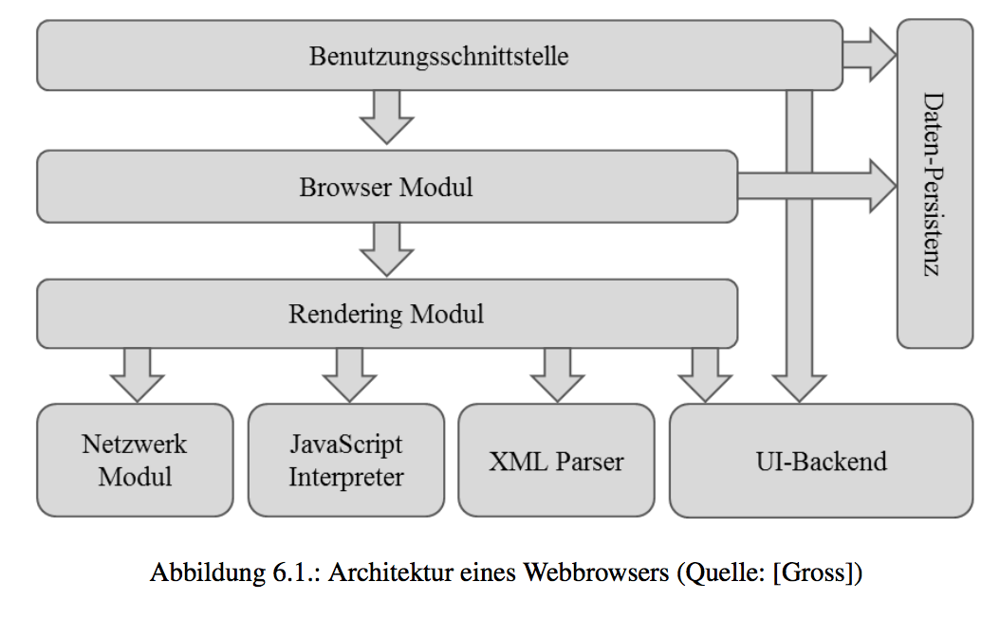
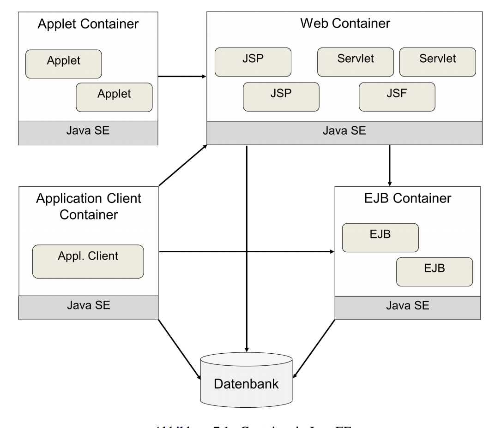
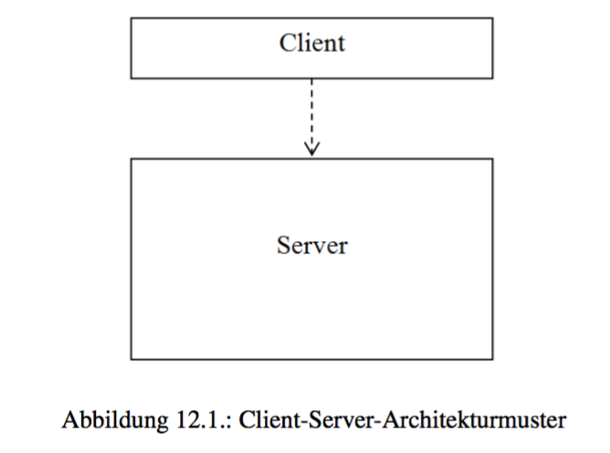
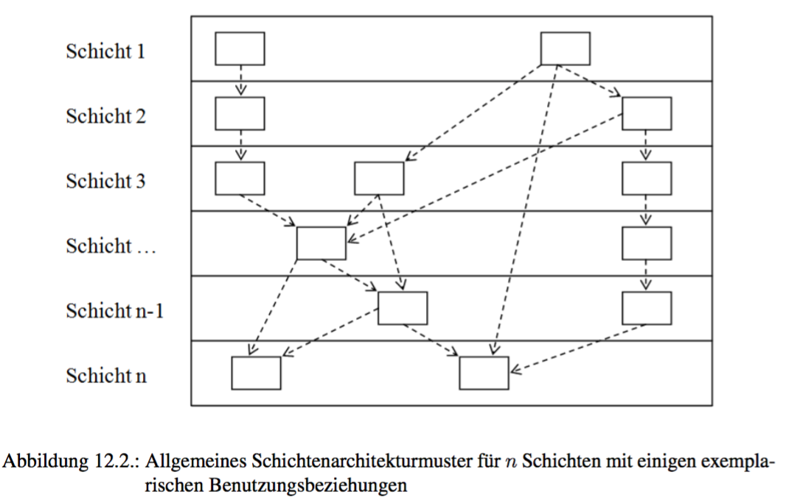
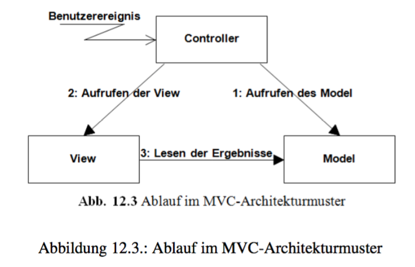

[TOC]

# Kurseinheit 1

## Kapitel 2

+ *Web-Anwendung* ist eine Client-Server-Anwendung, bei der zur Kommunikation zwischen Client und Server das HypertextTransfer Protocol (HTTP) eingesetzt wird und der Client ein (HTML-)Browser ist.
+ Web-Anwendungen haben besondere Spezifika:
  + *Gestaltungsmöglichkeit* - `HTML`,`CSS` und `JavaScript`
  + *Fenster* - nur ein Fenster, Browser
  + *Zulässige Programmabläufe* - schwierig, da Benutzer uber die Angabe einer `URL` grundsätzlich jede beliebige Web-Seite ansteuern und damit letztlich auch an beliebige Positionen im Programmablauf springen können.
  + *Kommunikationsaufwand* - erhöhter Kommunikationsaufwand, da Requests und Responses zwischen Client und Server übertragen werden müssen
  + *Installationsaufwand* - Installation und Wartung nur auf dem Server.
  + *Portabilität* - unproblematisch
  + *Verfügbarkeit* - Internet und Browser benötigt.
+ Rich Client vs. Thin Client

* Code on Demand - Java Applets oder JavaScript-Anweisungen

### Protokolle

Die Kommunikation zwischen Client und Server verläuft nach bestimmten Regeln. Diese sind in einem Protokoll definiert. 

| Schicht             | Protokoll |
| :------------------ | --------- |
| Anwendungsschicht   | HTTP      |
| Transportschicht    | TCT/UDP   |
| Vermittlungsschicht | IP        |

* OSI Modell - besteht aus 7 Schichten
  * Anwendungsschicht
  * Darstellungsschicht
  * Sitzungsschicht
  * Transportschicht
  * Vermittlungsschicht
  * Sicherungsschicht
  * Bitubertragung 

### IP und TCP

* `IP` und `TCP` Protokolle sogen für eine zuverlässige Datenübertragung
* `IPv4` verwendet 4 * 8Bits = 32Bits
* `IPv6` arbeitet mit 128Bit und wird in Hex notiert. 8 Blöcke je 4 stellige Hex Zahl
* `IP` Protokoll ist paketorientiert, d.h. Daten werden paketweise ubertragen.  **Ist unzuverlässig und verbindungslos!!**
* `TCP` ist verbindungsorientiert

### HTTP

* `HTTP`-Protokoll basiert auf Austausch von Nachrichten.
  * Client setzt eine Anfrge ab (Request)
  * Server beantwortet die Anfrage (Response)
  * Man Spricht von einer *Pull-Technologie*. Client initiiert die Kommunikation und "<u>zieht</u>" eine Antwort vomServer
* Eine `HTTP`-Nachricht, ob Request oder Response, ist ein einfacher ASCII-Text.
* Übertragungsmethoden:
  * GET - Parameter werden in der `URL` übertragen. Man beachte Längenbeschränkung
  * POST - Parameter werden an Header übertragen
  * Weitere: PUT, HEAD, TRACE, CONNECT

### HTML

+ `HTML` - Hypertext Markup Language

### XHTML

* Verwendet Syntax von `HTML` auf Basis von `XML`
* strikte Regeln, wie bei `XML`

### XML

* `XML`- Extensible Markup Language
* geeignet zur Beschreibung hierarchischer Strukturen
* **Vorteil**: Trennung von Struktur und Inhalt sowie die Plattformunabhängigkeit
* Groß und Kleinschreibung Unterscheidung 
* Definition von Dokumententyps erfolgt mit Hilfe Document Type Definition(DTD)
* *wohlgeformt* (well-formed) - Dokument, das die Syntaxregeln von `XML` einhält.
* *gultig* (valid) - Ein wohlgeformtes Dokument, dessen Struktur den Regeln einer angegebenen `DTD` entspricht.


### statischer Inhalt vs. dynamischer Inhalt

* *statischen Inhalten* - auf dem Server abgelegte Dateien, z.B. HTML Dokumente
* *dynamisch erzeugte Inhalte* - liegen in der Form, in der Sie an Client geschickt werden, nicht vor.

### Sessions

* Möglichkeit Session ID in Anfrage einzubinden:
  * URL- Rewriting- Session ID wird in der URL eingesetzt
  * Versteckte Formularfelder
  * Cookies

------

# Kurseinheit 2


## Kapitel 3

Kapitel `CSS`, `PHP`, `JavaScript` wurden überflogen.

## Kapitel 4

### ASP.NET vs Java EE

* `ASP.NET` -  Web Framework zur erstellung dynamisch erzeugten Internetseiten
* `.NET` Framework - stellt neben einer Laufzeitumgebung zur Programmausführung eine Sammlung von Klassenbibliotheken, Progammierschnittstellen und Dienstprogrammen zur Verfügung
* `ASP.NET` unterstützt drei Ansätze für die Erstellung von dynamisch erstellten Internetseiten:
  * `ASP.NET` Web Forms benutzt Steuerelemente und ein Ereignismodell, um eine komponentenbasierte Entwicklung zu unterstutzen
  * `ASP.NET` MVC wird das MVC-Muster unterstützt
  * `ASP.NET` Web Pages unterstützt die Entwicklung von Internetseiten, die eine Komposition aus Programmcode und HTML- Struktur enthalten.
* Java EE -  stellt Sammlung vn Spezifikationen für eine SW Architektur dar.
* Architektur unterteilt sich in vier Schichten:
  * Client-Schicht
  * Web-Schicht
  * Business-Schicht
  * Persistenzschicht
* 2013 umfasste 47 Spezifiktionsdokumente
* JavaEE ist herstellerunabhängig, aber sprachabhängig

### Ajax

+ `Ajax` - Asynchronous JavaScript and XML
+ Nur teil der Webseite kann aktualisiert, bzw nachgeladen werden
+ `Ajax` basiert auf XMLHttpRequest-Objekt, `JS`,`CSS`,`XML`
+ XMLHttpRequest-Objekt stellt den Kern von `Ajax` dar.

## Kapitel 5

### Bildformate

- [ ] muss ich hier noch zusammenfassen???


## Kapitel 6

### Webbrowser

* dient zur Anzeige von Dokumenten und Daten, speziell Internetseiten

* Hauptkomponenten eines Webbrowsers:

  * Die Benutzungsschnittstelle - z.b. Adresszeile
  * Das Browser-Modul - Vermittler zwischen BS und RM
  * Das Rendering-Modul - Darstellung einder Webseite. 1. Parsen der Seite in DOM, 2.
  * Das Netzwerk-Modul - HTTP - Anfrage weitergeben
  * Das UI-Backend (UI = User Interface - Benutzungsschnittstelle) - Stellt Informationen zu Standar HTML Elemente bereit
  * Ein JavaScript-Interpreter - üarst JS Code und interpretiert
  * Ein XML-Parser
  * Ein Datenspeicher zur persistenten Speicherung von Daten - Cookies, Bilder

  

# Kurseinheit 3

## Kapitel 7

### Java EE 

+ Architektur von Java EE orientiert sich an einer Schichtenarchitektur.

  + *Client-Computer*
  + *Java EE-Server* ist unterteilt in Web-Schicht und Businesslogik
  + *Datenbank-Server*

+ Ein *Application* Server - kein physischer Rechner, sondern eine Software, die auf einem Server installiert ist und eine Java EE-Spezifikation implementiert. 

+ Java EE-Spezifikation definiert vier Bereiche, die **Container** genannt werden

  + **Web Container** - zuständig für Servlet, JSF,  JSP. Verwaltet die Technologie
  + **EJB Container** -verwaltet auf der EJB basierte Elemente. Klassen die Businesslogik implementieren und Objekte
  + **Applet Container** -zuständig für die Verwaltung der Applets.
  + **Application Client** - Java GUI Anwendung

  ​

  

### Verzeichnisstruktur der JavaEE Webschicht

| Verzeichnis bzw. Datei    | Inhalt                                   |
| ------------------------- | ---------------------------------------- |
| */[Name]*                 | Name der Webanwendung. Wurzelverzeichnis |
| */[Name]/WEB-INF*         | Dateien die nur aus der Anwendung sichbar sind. |
| */[Name]/WEB-INF/classes* | Übersetzte Java Klassen                  |
| */[Name]/WEB-INF/lib*     | verwendete Java Bibliotheken             |
| */[Name]/WEB-INF/web.xml* | Deployment Descriptor der Web Anwendung  |
| */[Name]/META-INF*        | Metadaten über da WAR- Archiv und darin enthaltene Dateien |
| */[Name]/**               | Dateien, die über HTTP adressierbar sind. |

### Deployment Descriptor

* mit Deployment Descriptor können folgende Bereiche konfiguriert werden:
  * ServletContext-Initialisierungsparameter
  * Session-Konfiguration
  * Servlet-Deklarationen
  * Servlet-Mappings
  * Filter-Definitionen
  * Filter-Mappings
  * Welcome File List
  * Fehlerseiten

``` xml
<?xml version="1.0" encoding="UTF-8"?>
<web-app version="3.0" xmlns="http://java.sun.com/xml/ns/javaee" 
  xmlns:xsi="http://www.w3.org/2001/XMLSchema-instance" 
  xsi:schemaLocation="http://java.sun.com/xml/ns/javaee 
  http://java.sun.com/xml/ns/javaee/web-app_3_0.xsd">
    <servlet>
        <servlet-name>MeinServlet</servlet-name>
        <servlet-class>kurs1796.MeinServlet</servlet-class>
    </servlet>
    <servlet-mapping>
        <servlet-name>MeinServlet</servlet-name>
        <url-pattern>/start/*</url-pattern>
    </servlet-mapping>

  <!-- Konfiguration der Startseite -->
    <welcome-file-list>
      <welcome-file>start</welcome-file>
    </welcome-file-list>
</web-app>
```

### Annotations

+ mit Hilfe von Annotation lassen sich Meta-Informationen in den Quelltext einbeziehen
+ man unterscheide  zwei Arten von Annotationen 
  + Annotationen,die die Semantik des Programmcodes ändern 
  + und Annotationen, die die Semantik nicht ändern
+ Wichtige Annotation für diesem Kurs ist `@WebServlet`
  + Deklariert ein eine Java Klasse als Webservlet
  + Pflicht Paramter sind entweder `value` oder `urlPatterns`, beide dürfen nicht angegeben werden

```java
// Servlet Deklaration durch Annotation @WebServlet
@WebServlet(value={"/start","/musterServlet"})
public class MusterServlet extends HttpServlet {
    protected void doGet( HttpServletRequest request, HttpServletResponse 							response) throws ServletException, IOException {
    ...
    }
 ...   
}


// Servlet Deklaration durch Annotation @WebServlet mit mehreren Parametern
@WebServlet(name="MusterServlet", urlPatterns={"/start","/musterServlet"})
public class MusterServlet extends HttpServlet {
    protected void doGet(HttpServletRequest request, HttpServletResponse
                         response) throws ServletException, IOException {
 ...
	}
 ...
}
```

## Kapitel 8

### Servlets: Request-Ablauf

* Web Container nimmt HTTP request entgegen
* Request wird in `HttpServletRequest`-Objekt umgewandelt
* Es wird ein leeres Antwortobjekt erzeugt, `HttpServletResponse`, welches auch ein Objekt der Klasse `PrintWriter` bereit stellt
* Web Container ruft mit den Request und Response object die öffentliche `service()` Methode des Servlets auf.
* Diese ruft wiederum die geschützte Methode `service()` des Servlets auf, die als "Dispatcher" dient.
* Die Anfrage wird an die doGet/doPost Methode weitergeleitet.


### Aufgabe, Lebenszyklus, Thread-Sicherheit

+ Servlet Klasse wird von `HttpServlet` abgeleitet
+ Servlet kann nach Bedarf folgende Aufgaben ausführen:
  + vom Client gesendete Daten lesen
  + vom Client gesendeten HTTP Request Header lesen
  + Ergebnisse erzeugen
  + HTTP Response Header setzen
  + Antwort Dokument erstellen
+ Servlet hat einen fest definierten Lebenszyklus:
  + Initialisierung
  + Request Bearbeitung
  + Zerstörung
+ Web Container startet fur die Dauer der Anwendung <u>genau eine Instanz</u> pro Servlet
+ Alle Threads greifen auf die selbe Instanz des Servlets zu => *Thread- sicher*
  + 1. Variante: Keine Instanzvariablen verwenden!!
    2. Variante: alle Instanzvariablen in der `init()`-Methode des Servlets mit Werten zu füllen und bei allen Aufrufen der `service(...)`-Methode nur lesend auf diese Instanzvariablen zuzugreifen
    3. Variante: Lese und Schreibvorgänge erlauben, diese jedoch synchronisieren

### Scopes

+ *Request Scope* - durch die Schnittstelle `HttpServletRequest` definierte Request Objekt. Bewahrt Daten für die Dauer eines Requests. Wird vom Web Container bei jedem Request erzeugt, dem Servlet zur Verfügung gestellt und nach Ablauf des Requests geloscht.
+ *Session Scope* - durch die Schnittstelle `HTTPSession` definiertes Session Objekt. Bewahrt die Daten für die Dauer einer Session. Session-Objekt wird vom Request-Objekt mittels der Methode `getSession()` angesprochen
+ *Application Scope* - durch das Interface `ServletContext` definierte ContextObjekt. Bewahrt Daten für die gesamte Dauer der Webanwendung. ContextObjekt wird von einem Servlet mittels der Methode `getServletContext()` angesprochen.
+ *Page Scope* - besitzt nur JSP lokale Daten => nur JSP relevant

### Java Beans

+ dienen zum Speichern von Objektinformationen

### Servlet API

* **abstrakte Klasse HttpServlet** - gibt das Grundgerüst einer Servlet Klasse vor
* **Schnittstelle HttpServletRequest**
  * Unterschied zwischen Attributen und Parametern einer Anfrage besteht darin, dass in Attributen auch Java-Objekte gespeichert werden konnen, in Parametern lediglich Zeichenketten.
* **Schnittstelle HttpServletResponse**
* **Schnittstelle HttpSession**
* **Schnittstelle ServletContext**
* **Schnittstelle RequestDispatcher**


## Kapitel 9

* `JSP` ist eine Technologie, die
  * Entwurf dynamischer Webseiten unterstützt
  * Java Code in HTML Code eingebettet ist
  * `JSP` spezifische Tags unterstützen Trennung von Programmlogik und Layout

### JSP: Request-Ablauf

- verläuft analog zu Servlet Request
- Beim ersten Aufruf wird aus JSP Seite ein Servlet generiert.


### Template-Text, JSP-Kommentare undJSP-Direktiven

* **Template Text** - jede Form vom statischem Text, der an den Client gesendet wird. z.b. HTML Tags, HTML Kommentare


* **JSP Kommentar** - im Gegensatz zu HTML-Kommentar, ist nicht Teil der an den Client gesendeten Response.
* **JSP Direktive** - enthalt Informationen bzw. Anweisungen für den Web-Container. Es könne z.B. Java Klassen/Pakete importiert werden

| Direktive | Attribute     | Bedeutung                                |
| :-------- | :------------ | :--------------------------------------- |
| `page`    | `import`      | Import-Anweisung für die aus der JSP erzeugte Servlet- Klasse; mehrere importierte Klassen und Pakete können durch Kommata getrennt aufgefuhrt werden. |
|           | `errorPage`   | Relative URI einer anderen JSP-Seite, die angesteuertwird, falls bei Ausführung einer JSP-Seite eine Exception auftritt und die Verarbeitung nicht fortgeführt werden kann. |
|           | `isErrorPage` | Erklärt eine JSP-Seite als Fehlerseite, auf die von einer anderen JSP-Seite über das Attribut `errorPage` verwiesen werden kann |
|           | `contentType` | Gibt den Dokumenttyp der Response an. Der Standardwert ist `text/html` |
| `include` | `file`        | Relative URI einer anderen JSP-Seite oder eines HTML Fragments,die/das an der angegebenen Stelle zur Übersetzungszeit eingefügt wird |
| `taglib`  |               |                                          |
|           | `prefix`      | Gibt ein frei wählbares Präfix für die Tags der Tag-Bibliothek an, um diese innerhalb der JSP-Seite ansprechen zu konnen |
|           | `uri`         | Gibt eine URI an, die auf die Tag-Bibliothek verweist. Diese URI kann eine URL, eine URN oder ein Pfadname sein. |


### JSP-Deklaration

+  JSP Deklaration bietet eine Möglichkeit Variablen und Methoden zu deklarieren
+  Werten Teil des Servlets, ausserhalb der `jspService(...)`-Methode
+  Variablendeklaration sollte mit Vorsicht verwendet werden, wegen der Thread-Sicherheit.
+  Deklaration erfolgt zwischen `<%! .. %>`

### JSP-Ausdruck

+ ist ein auswerbarer Ausdruck
+ Ausdruck steht zwischen `<%= ...%>`
+ Es darf immer nur ein einziger Ausdruck zwischen `<%= ...%>`  stehen

### JSP-Scriplets

+ ist eine Java-Anweisung, mit der z.B. eine Berechnung, ein Datenbankzugriffoder ein Anwendungskernaufruf durchgefuhrt werden kann.
+ Ausgabe an den Client nur durch `println(...) `-Methode
+ Scriplets stehen zwischen `<% ... %>`


### JSP-Aktionen

+ JSP-Aktionen decken einen Teil der Funktionalitat von Scripting-Elementen ab
+ Syntax entspricht  der XML-Syntax
+ Mit JSP-Aktionen konnen u.a. Objekte erzeugt und bearbeitet, auszuwertende Aus- ¨drucke erstellt, Requests an andere JSP-Seiten oder Servlets weitergeleitet oder Java-Applets ¨integriert werden
+ `  <jsp:action attribut1="wert1" attribut2="wert2"...> ... </jsp:action> `

### Expression Language

+ Mit der Expression Language (EL), kann man von einer JSP-Seite auf in einem Scope gespeicherte Objekte und, sofern dies JavaBeans sind, auch auf deren Properties (Eigenschaften) zugreifen

+ Einfach Syntax

+ nicht ohne weiteres möglich, Objekte zu erzeugen/modifizieren

+ `$<Ausdruck>` -EL Ausdruck wird bei der Übersetzung der JSP-Seite ausgewertet

+ weitere Mögliche Form: `#<Ausdruck>`

  + verzögerte Auswertung, heisst Auswertung nur wenn diese benötigt wird.
  + darf nur in bestimmten Attributtweeden stehen
  + wird vornehmlich in JSF eingesetzt

+ EL sucht die Objekte zuerst in Page Score, dann in Request Score, danach im Session Score und zum Schluss im Application Score. 

+ Syntax Beispiele:

+ ```jsp
  ${kunde.firstName}
  <!-- oder -->
  ${kunde["firstName"]}

  ${kunde.adresse.strasse}
  <!--oder--> 
  ${kunde["adresse"]["strasse"]}

  <!--Auf die Elemente von Arrays oder Listen kann nur über die Variante mit den eckigen Klammern zugegriffen werden, wahlweise mit oder ohne Hochkommata:-->
  ${warenkorb[0]} 
  ${warenkorb["0"]}

  <!--Ist der String "deutschland" unter dem Namen land in einem Scope abgelegt, dann führen die Zugriffe zum selben Ergebnis-->
  ${hauptstaedte[land]}  
  ${hauptstaedte["deutschland"]}

  ```

+ Es gibt eine implizite Fehlerbehandlung. Wenn ein Objekt `null` ist, dann wird einfach `null` zurückgeliefert.


### JavaServer Pages Standard Tag Library

+ Wenn die Funktionalität von EL Ausdrücken nicht ausreicht, bietet sich die Verwendung von `JSTL` an
+ Mit Hilfe von `JSTL` kann z.B. Iterationen über Mengen von Objekten, bedingte Auswertungen oder spezielle Formatierungen der Ausgabe erfolgen.
+ JSTL muss explizit auf der JSP Seite eingebunden werden
  + `<%@ taglib uri="http://java.sun.com/jsp/jstl/core" prefix="c"%>`

## Kapitel 10  

### Servlets und JavaServer PagesTechnologie aus SoftwareEngineering Sicht

Thema des Kapitels ist MVC und Trettung von Verantwortlichkeiten

# Kurseinheit 4

## Kapitel 11

+ gute Architektur für ein ein Softwaresystem ist:
  + welche adäquate Basis zur Realisierung der funktionalen und nicht- funktionalen Anforderungen bietet
  + allgemein wie möglich und speziell wie nötig.
  + Komponenten haben eine hohe Kohäsion und haben klare Trennung von Verartwortlichkeiten
  + Komponenten haben eine geringen Kopplung


## Kapitel 12

### Client-Server-Architekturmuster

+ einfaches Muster

+ System wird in zwei Komponenten zerlegt: Client und Server

+ Server bietet Dienste an, Client nutzt diese

+ Server kennt den Client nicht

  


### Schichtenarchitekturmuster

+ Verfeinerung des Client-Server Architekturmusters

+ Server wird in rekursiver Weise wieder gemäß dem Client-Server-Architekturmuster strukturiert.

+ Jede Komponenten darf nur genau eine andere Komponente benutzen. Ausnahme bildet die unterste Komponentenschicht.

  


+ Benutzungsbeziehungen zwischen Schichten sind aufgrund der Vorgaben des Schichtenarchitekturmusters zyklenfrei.
+ es ergibt sich eine geringe Kopplung zwi-schen den Schichten.


### MVC-Architekturmuster

+ häufig für interaktive Anwendungsprogramme verwendet

+ besteht aus den drei Komponenten: *Model* (M), *View* (V) und *Controller* (C)

+ Model = Anwendungskern, View= Benutzeroberfläche, Controller = analysiert Benutzerereignisse

  

+ Benutzungsbeziehungen sind einfach und enthalten keine Zyklen


## Kapitel 13

### 5-Schichten-Architektur

+ Schichtenarchitektur hat sich in Webanwendungen etabliert.
+ Webanwendung besteht aus 4 Schichten
+ Browser stellt die 5. Schicht dar
+ *Datenhaltung*-Schicht - besteht aus einer Datenbank
+ *Anwendungsobjekte*-Schicht - repräsentiert das auf Entitätsklassen und ihren Beziehungen reduzierte Klassenmodell 
+ *Anwendungslogik*-Schicht - beinhaltet die fachliche Funktionalität der Anwendung. Anwendungslogik der Kontrollklassen.
+ *Web*-Schicht - nimmt Client Anfragen an und liefert die Antworden an den Client zurück
+ **Regeln:**
  + Request wird nur von Web-Schicht entgegengenommen
  + Web-Schicht verwendet Anwendungslogik, in Ausnahmefällen kann auch auf  Anwendungsobjekte und Datenhaltung zugreifen
  + Anwendungsobjekte greifen auf keine andere Schicht zu
  + Datenhaltung wird also nur von der Anwendungslogik angesteuert.

### Model-1-Architektur

+ entstand aus einer auf Web-Anwendungen zugeschnittenen Instanziierungdes Client-Server-Architekturmusters.

+ Server wird Model genannt, entspricht dem Model des MVC-Musters

+ Client = Web Komponente

+ Im Unterschied zur 5-Schichten-Architektur werden hier technische Vorgaben für die Realisierung von Komponenten (hier der Web-Komponente) gemacht.

  


+ Aufgabenbereiche der Architekturkomponenten sind klar voneinander getrennt
+ die Kohäsion der Web-Komponente ist suboptimal
+ Web-Komponente ist nur über JSP Seiten realisiert.  Pro Anfrage wird also sowohl Steuerung der Anfrageverarbeitung, als auch die Präsentation von der JSP Seite übernommen.
+ Vermischt HTML und Java Code
+ Keine gute Architektur!

### Model-2-Architektur

+ Instanziierung des MVC-Architekturmusters entstand die Model-2-Architektur

+ JSP übernimmt aufgaben der View

+ Servlets übernimmt aufgaben des Controllers

+ Model entspricht dem Anwendungskern

+ Es werden technische Vorgaben für die Realisierung von Komponenten gemacht

  

