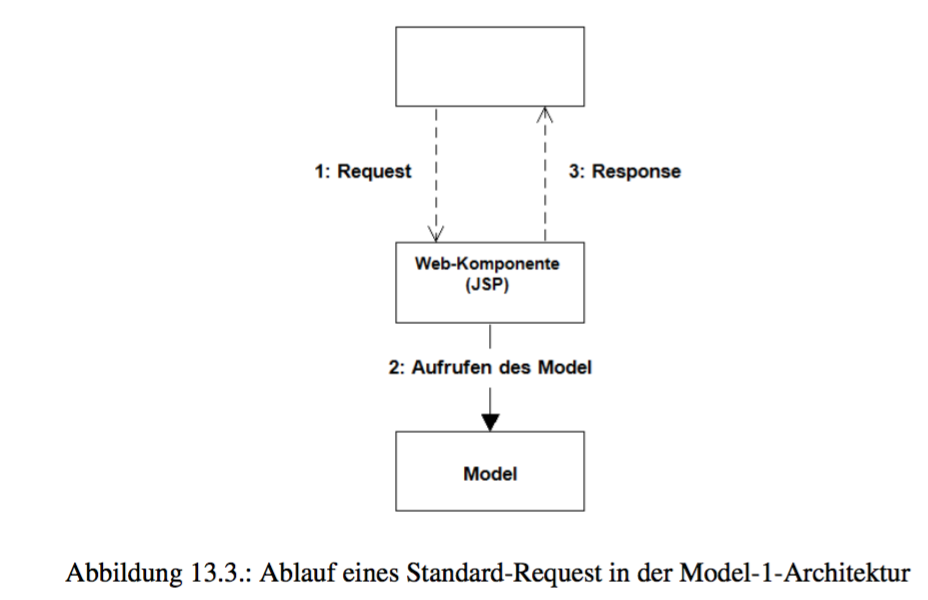
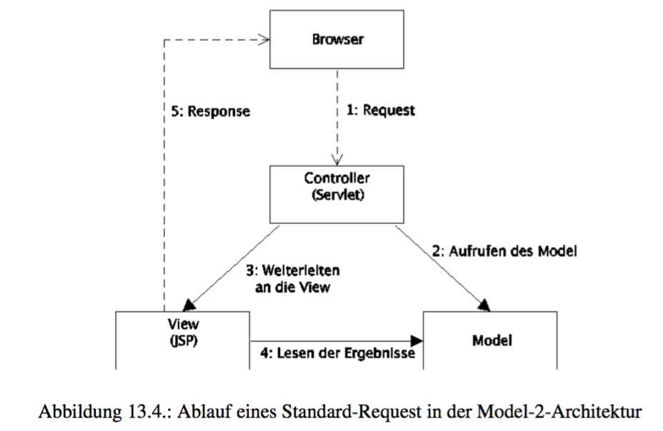

[TOC]

# Kurseinheit 4

## Kapitel 11

- gute Architektur für ein ein Softwaresystem ist:
  - welche adäquate Basis zur Realisierung der funktionalen und nicht- funktionalen Anforderungen bietet
  - allgemein wie möglich und speziell wie nötig.
  - Komponenten haben eine hohe Kohäsion und haben klare Trennung von Verartwortlichkeiten
  - Komponenten haben eine geringen Kopplung

## Kapitel 12

### Client-Server-Architekturmuster

- einfaches Muster

- System wird in zwei Komponenten zerlegt: Client und Server

- Server bietet Dienste an, Client nutzt diese

- Server kennt den Client nicht

  

### Schichtenarchitekturmuster

- Verfeinerung des Client-Server Architekturmusters

- Server wird in rekursiver Weise wieder gemäß dem Client-Server-Architekturmuster strukturiert.

- Jede Komponenten darf nur genau eine andere Komponente benutzen. Ausnahme bildet die unterste Komponentenschicht.

  

- Benutzungsbeziehungen zwischen Schichten sind aufgrund der Vorgaben des Schichtenarchitekturmusters zyklenfrei.
- es ergibt sich eine geringe Kopplung zwi-schen den Schichten.

### MVC-Architekturmuster

- häufig für interaktive Anwendungsprogramme verwendet

- besteht aus den drei Komponenten: *Model* (M), *View* (V) und *Controller* (C)

- Model = Anwendungskern, View= Benutzeroberfläche, Controller = analysiert Benutzerereignisse

  

- Benutzungsbeziehungen sind einfach und enthalten keine Zyklen

## Kapitel 13

### 5-Schichten-Architektur

- Schichtenarchitektur hat sich in Webanwendungen etabliert.
- Webanwendung besteht aus 4 Schichten
- Browser stellt die 5. Schicht dar
- *Datenhaltung*-Schicht - besteht aus einer Datenbank
- *Anwendungsobjekte*-Schicht - repräsentiert das auf Entitätsklassen und ihren Beziehungen reduzierte Klassenmodell 
- *Anwendungslogik*-Schicht - beinhaltet die fachliche Funktionalität der Anwendung. Anwendungslogik der Kontrollklassen.
- *Web*-Schicht - nimmt Client Anfragen an und liefert die Antworden an den Client zurück
- **Regeln:**
  - Request wird nur von Web-Schicht entgegengenommen
  - Web-Schicht verwendet Anwendungslogik, in Ausnahmefällen kann auch auf  Anwendungsobjekte und Datenhaltung zugreifen
  - Anwendungsobjekte greifen auf keine andere Schicht zu
  - Datenhaltung wird also nur von der Anwendungslogik angesteuert.

### Model-1-Architektur

- entstand aus einer auf Web-Anwendungen zugeschnittenen Instanziierungdes Client-Server-Architekturmusters.

- Server wird Model genannt, entspricht dem Model des MVC-Musters

- Client = Web Komponente

- Im Unterschied zur 5-Schichten-Architektur werden hier technische Vorgaben für die Realisierung von Komponenten (hier der Web-Komponente) gemacht.

  

- Aufgabenbereiche der Architekturkomponenten sind klar voneinander getrennt
- die Kohäsion der Web-Komponente ist suboptimal
- Web-Komponente ist nur über JSP Seiten realisiert.  Pro Anfrage wird also sowohl Steuerung der Anfrageverarbeitung, als auch die Präsentation von der JSP Seite übernommen.
- Vermischt HTML und Java Code
- Keine gute Architektur!

### Model-2-Architektur

- Instanziierung des MVC-Architekturmusters entstand die Model-2-Architektur

- JSP übernimmt aufgaben der View

- Servlets übernimmt aufgaben des Controllers

- Model entspricht dem Anwendungskern

- Es werden technische Vorgaben für die Realisierung von Komponenten gemacht

  

