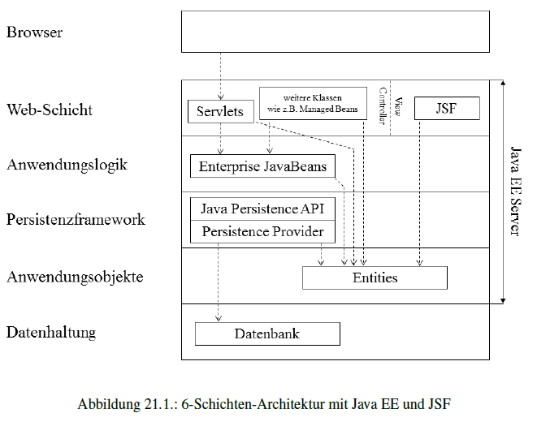
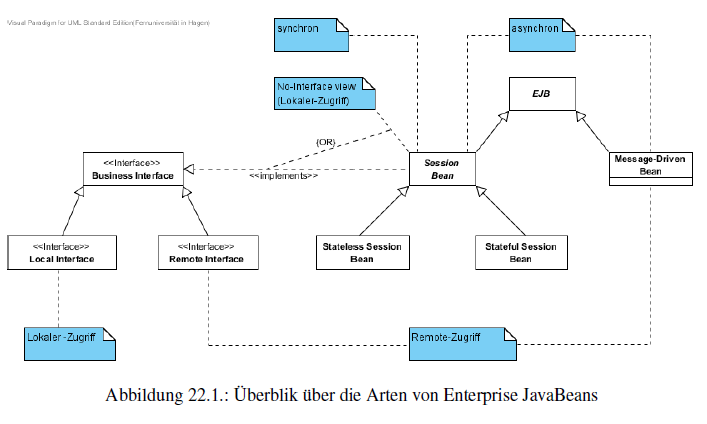

[TOC]

# Kurseinheit 6

## Kapitel 21

### Enterprise JavaBeans und Entities

+ Mit Hilfe von *Enterprise JavaBeans* (EJB) wird die Anwendungslogik realisiert
+ Instanzen von EJB-Klassen  werden in einem Container des Java EE-Servers ausgeführt

+ *Entities* sind vergleichbar mit Instanzen von Entitätsklassen
+ Persistierung erfolgt über *Java Persistence API*
+ Java Persistence API stellt eine vom EJB-Container implementierte Schnittstelle dar
+ *Persistence Provider* ist uber die Persistence API angebundene Persistenzframework

## Kapitel 22

### Enterprise JavaBeans

+ EJB's bieten folgende Möglichkeiten
  + synchroner oder asynchroner Zugriff
  + Client-spezifischer Zustand
  + Verteilung mit transparentem Remote-Zugriff und Lastausgleich
  + konfigurierbares automatisches Transaktionsmanagement
  + Sicherheitsmanagement
+ oben genannte Dienste werden vom EJB-Container übernommen

### Synchroner und asynchroner Zugriff: Session Bean und Message-Driven Bean
+ Es werden zwei Arten vopn EJB's unterschieden:
  + Session Beans - Ab EJB3.1 werden asynchrone Methodenaufrufe unterstützt
  + und Message-Driven Beans - unterstützt ausschliesslich asynchrone Methodenaufrufe.
    +  Methodenaufrufe werden bei *Nachrichtenwarteschlange* angemeldet
    +  > Über einen vom Application Server bereitgestellten Nachrichtendienst kann ein Client so Nachrichten an die Message-Driven Bean senden, welche darauf mit der Ausfüuhrung von Anwendungslogik reagiert.
       > Diese Reaktion erfolgt asynchron, d.h. der Aufrufer sendet lediglich seine Nachricht und arbeitet dann parallel weiter, ohne auf eine R¨uckmeldung der Bean zu warten. [S210 Kurstext]

### Clientspezifischer Zustand: Stateful und Stateless Session Bean

+ Es existieren zwei Varianten von Session Bean
  + Stateless 
  + und Stateful Session Beans.
+ Instanz der Stateless Session Bean wird dem Client erst bei  Ausführung einer Methode zugeordnet. Danach kommt  die Instanz in ein Pool
+ Stateless Session Bean könnte ein Zustand haben, ist aber nicht empfehlenswert, da parallel existierende Instanzen unterschiedliche Zustande haben können, ohne Client Zuordnung
+ Es implementiert nur Methoden, keine Attribute!
+ Stateful Session Bean ist immer einem bestimmten Client zugeordnet
+ *Conversational State* -wenn zu jedem Client ein spezifischer Zustand nachgehalten wird.

+ Session Bean sollte nur stateful implementiwert werden, wenn es wirklich benötigt wird.
+ Durch wiederverwendung der Instanzen können Ressourcen gespart werden und positive Performance auswirkungen haben

### Verteilung mit transparentem Remote-Zugriff und Lastausgleich – Remote- und Local Interfaces für Session Beans
+ Message-Driven Beans eignen sich zur Verteilung der Lasten
+ Session Beans unterscheiden  zwischen Remote-Zugriff und lokalem Zugriff
+ Ab EJB Version 3.1 wird für lokale Aufrufe kein Local Interface mehr benötigt, man spricht hier von *No-Interface view*. Die Bean kann direkt abgesprochen werden. (public Methoden)
+ Eine Session Bean kann sowohl ein Local Interface als auch ein Remote Interface implementieren und die No-Interface view unterstützen
+ bei der Implementierung von Local Interface oder No-Interface view sollte keine  Spezifika des lokalen Aufrufs(call by Referenz, nicht serialisierbare
  Typen für Parameter) verwendet werden, so kann es später ohne grossen aufwand auf Remote Interface umgestellt werden

### Transaktionsmanagement
+ Transaktion ist eine Folge von Ausführungsschritten, die eine logische Einheit bildet.
+ Eine Transaktion muss ACID-Eigenschaften erfüllen
  +  Atomicity(Atomatirär) - ganz oder garnicht
  +  Consistency(Konsistenz) - keine inkonsistenten Daten( z.B. unauflösbare Referenzen)
  +  Isolation(Isolation) - zwei Transaktionen dürfen sich nicht beeinflüssen
  +  Durability(Persistenz) - Daten müssen dauerhapft persistiert werden

### Rollenverteilung der Java EE-Plattform (Platform Roles)

| Rolle                        | Aufgaben                                 |
| :--------------------------- | :--------------------------------------- |
| **Enterprise Bean Provider** | Erstellung einer oder mehrere Java Enterprise Beans. Bereitstellung der Enterprise Java Beans für den Application |
| **Application Assembler**    | Zusammenstellung einer Enterprise Application aus einzelnen Anwendungskomponenten. Bereitstellung für den Deployer |
| **Deployer**                 | Installation von Web-Anwendungen und EJBs in einem Container inkl. der Konfiguration. |
| **System Administrator**     | Einrichtung, Betrieb und U¨ berwachung des Systems |

### Annotationen vs. Deployment-Deskriptoren
+ Verwendung der Annotationen ist einfacher
+ Meta-Informationen werden direkt an die Programmtext-Teile geheftet
+ Durch die Gültigkeitsprüfungen des Compilers ist Verwendung der Annotation weniger fehleranfällig
+ Vorteil von Deployment Deskriptor ist, dass die Änderung ohne erneutem Kompilieren erfolgen kann. z.B. Austausch vom Interface-Typ
+ Meta-Information aus dem Deployment Deskriptor überstimmt  die Information aus Annotation

### EJB Arten

###Callback-Methoden & Lebenszyklus einer Session Bean
Kurstext Seite 225

### Interceptors
+ Objekte die einen Methodenaufruf abfangen und  vor und/oder anch der Ausführung weitere Aktionen einfügen
+ Wird durch eine einfach Java Klasse realisiert
+ Interceptor-Objekt muss über eine (oder mehrere) Methoden verfügen, die an die Business-Methoden von EJBs angehängt oder ihnen vorangestellt werden.
+ Können z.B. zur Messung der Ausführungszeit von Methoden verwendet werden.
+ Es ist auch möglich Interceptor- Methode direkt in eine EJB-Klasse zu integrieren. solche Methode wird dann jeden Aufruf einer beliebigen Business-Methode dieser EJB-Klasse abfangen

### Lookup einer Session Bean
+ JNDI - Java Naming and Directory Interface ist ein Namens- und Verzeichnisdienst zur Referenzierung von JavaEE Ressourcen
+ Ausgangspunkt für JNDI-Lookups dient InitialContext.
+ Voraussetzungen um einer Managed Bean eine Session Bean über einen JNDI-Lookup zu beziehen:
  + Session Bean muss in einem der Client Komponente zugändlichen Kontext verzeichnet sein
  + Der Name muss bekannt sein